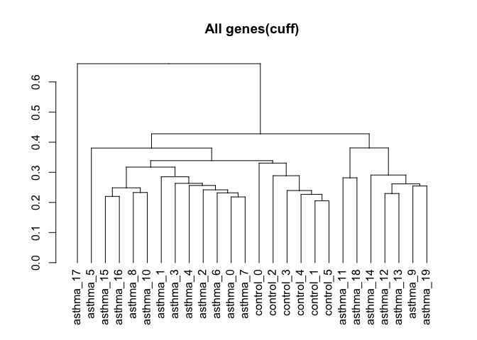
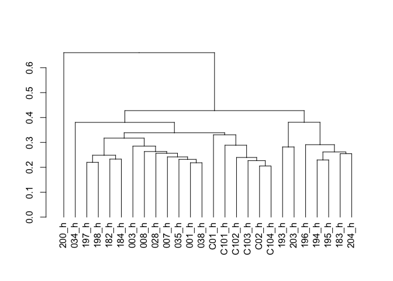
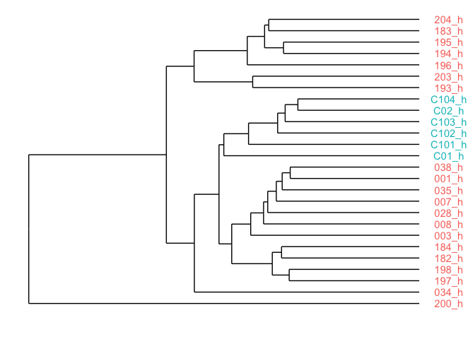

Apply dendrogram labels (in cummeRbund)
================
Matthew L Bendall
September 12, 2016

### Load cummeRbund data

``` r
# Use CummeRbund to load data from cuffdiff output
# This takes awhile the first time around, but is faster on subsequent loads
cuff <- readCufflinks('/Users/bendall/Projects/asthma/results20160218/cuffdiff',
                      genome="hg38")
cuff
```

    ## CuffSet instance with:
    ##   2 samples
    ##   75005 genes
    ##   182152 isoforms
    ##   103651 TSS
    ##   34433 CDS
    ##   75005 promoters
    ##   103651 splicing
    ##   18279 relCDS

### Take a look at the replicate-level data

``` r
DT::datatable(replicates(cuff), 
              options=list(searching=FALSE, scrollX=TRUE))
```

<!--html_preserve-->

<script type="application/json" data-for="htmlwidget-8ec8112294c3e3d8f04e">{"x":{"filter":"none","data":[["1","2","3","4","5","6","7","8","9","10","11","12","13","14","15","16","17","18","19","20","21","22","23","24","25","26"],["/lustre/groups/cbi/asthma/host/hg38/001_h/abundances.cxb","/lustre/groups/cbi/asthma/host/hg38/003_h/abundances.cxb","/lustre/groups/cbi/asthma/host/hg38/007_h/abundances.cxb","/lustre/groups/cbi/asthma/host/hg38/008_h/abundances.cxb","/lustre/groups/cbi/asthma/host/hg38/028_h/abundances.cxb","/lustre/groups/cbi/asthma/host/hg38/034_h/abundances.cxb","/lustre/groups/cbi/asthma/host/hg38/035_h/abundances.cxb","/lustre/groups/cbi/asthma/host/hg38/038_h/abundances.cxb","/lustre/groups/cbi/asthma/host/hg38/182_h/abundances.cxb","/lustre/groups/cbi/asthma/host/hg38/183_h/abundances.cxb","/lustre/groups/cbi/asthma/host/hg38/184_h/abundances.cxb","/lustre/groups/cbi/asthma/host/hg38/193_h/abundances.cxb","/lustre/groups/cbi/asthma/host/hg38/194_h/abundances.cxb","/lustre/groups/cbi/asthma/host/hg38/195_h/abundances.cxb","/lustre/groups/cbi/asthma/host/hg38/196_h/abundances.cxb","/lustre/groups/cbi/asthma/host/hg38/197_h/abundances.cxb","/lustre/groups/cbi/asthma/host/hg38/198_h/abundances.cxb","/lustre/groups/cbi/asthma/host/hg38/200_h/abundances.cxb","/lustre/groups/cbi/asthma/host/hg38/203_h/abundances.cxb","/lustre/groups/cbi/asthma/host/hg38/204_h/abundances.cxb","/lustre/groups/cbi/asthma/host/hg38/C01_h/abundances.cxb","/lustre/groups/cbi/asthma/host/hg38/C02_h/abundances.cxb","/lustre/groups/cbi/asthma/host/hg38/C101_h/abundances.cxb","/lustre/groups/cbi/asthma/host/hg38/C102_h/abundances.cxb","/lustre/groups/cbi/asthma/host/hg38/C103_h/abundances.cxb","/lustre/groups/cbi/asthma/host/hg38/C104_h/abundances.cxb"],["asthma","asthma","asthma","asthma","asthma","asthma","asthma","asthma","asthma","asthma","asthma","asthma","asthma","asthma","asthma","asthma","asthma","asthma","asthma","asthma","control","control","control","control","control","control"],[0,1,2,3,4,5,6,7,8,9,10,11,12,13,14,15,16,17,18,19,0,1,2,3,4,5],["asthma_0","asthma_1","asthma_2","asthma_3","asthma_4","asthma_5","asthma_6","asthma_7","asthma_8","asthma_9","asthma_10","asthma_11","asthma_12","asthma_13","asthma_14","asthma_15","asthma_16","asthma_17","asthma_18","asthma_19","control_0","control_1","control_2","control_3","control_4","control_5"],[17384400,18432300,19124700,19642800,15109400,6893200,16568600,18356800,24553400,22244800,27879600,17995600,21550000,23143200,25642200,19954000,24716800,6621280,18526900,19101500,7528250,16449500,17531200,20721000,18967700,19276300],[17911500,17911500,17911500,17911500,17911500,17911500,17911500,17911500,17911500,17911500,17911500,17911500,17911500,17911500,17911500,17911500,17911500,17911500,17911500,17911500,17911500,17911500,17911500,17911500,17911500,17911500],[0.86619,0.953063,0.920414,1.0034,0.704041,0.281123,0.810527,0.851304,1.55754,1.45337,1.7234,1.13005,1.42121,1.51025,1.71944,1.26229,1.52035,0.454299,1.17184,1.2441,0.298223,0.942874,0.991847,1.12513,1.19039,1.14347],[1,1,1,1,1,1,1,1,1,1,1,1,1,1,1,1,1,1,1,1,1,1,1,1,1,1]],"container":"<table class=\"display\">\n  <thead>\n    <tr>\n      <th> \u003c/th>\n      <th>file\u003c/th>\n      <th>sample_name\u003c/th>\n      <th>replicate\u003c/th>\n      <th>rep_name\u003c/th>\n      <th>total_mass\u003c/th>\n      <th>norm_mass\u003c/th>\n      <th>internal_scale\u003c/th>\n      <th>external_scale\u003c/th>\n    \u003c/tr>\n  \u003c/thead>\n\u003c/table>","options":{"searching":false,"scrollX":true,"columnDefs":[{"className":"dt-right","targets":[3,5,6,7,8]},{"orderable":false,"targets":0}],"order":[],"autoWidth":false,"orderClasses":false},"selection":{"mode":"multiple","selected":null,"target":"row"}},"evals":[],"jsHooks":[]}</script>
<!--/html_preserve-->
### Plot the dendrogram

``` r
dend.rep <- csDendro(genes(cuff), replicates=T)
```



As you can see here, the tips of the resulting dendrogram have useless names. Plus, these names are not stable across analyses with different groupings or numbers of samples.

### Set up vector with desired names

Create a named vector where the values are the desired names, and the names are the labels used in the above dendrogram. In this case, the files used in the analysis were named with the patient ID, so we can extract the patient IDs from the `file` column.

``` r
# goodnames (in the same order as the table):
goodnames <- gsub('/lustre/groups/cbi/asthma/host/hg38/', '', replicates(cuff)$file)
goodnames <- gsub('/abundances.cxb', '', goodnames)

# give the vector names using the rep_name column
names(goodnames) <- replicates(cuff)$rep_name
goodnames
```

    ##  asthma_0  asthma_1  asthma_2  asthma_3  asthma_4  asthma_5  asthma_6 
    ##   "001_h"   "003_h"   "007_h"   "008_h"   "028_h"   "034_h"   "035_h" 
    ##  asthma_7  asthma_8  asthma_9 asthma_10 asthma_11 asthma_12 asthma_13 
    ##   "038_h"   "182_h"   "183_h"   "184_h"   "193_h"   "194_h"   "195_h" 
    ## asthma_14 asthma_15 asthma_16 asthma_17 asthma_18 asthma_19 control_0 
    ##   "196_h"   "197_h"   "198_h"   "200_h"   "203_h"   "204_h"   "C01_h" 
    ## control_1 control_2 control_3 control_4 control_5 
    ##   "C02_h"  "C101_h"  "C102_h"  "C103_h"  "C104_h"

Check that the new vector matches the `replicates(cuff)` table.

### Relabel dendrogram

Set the labels in the new dendrogram to desired labels. The `labels` function is in the `dendextend` package (install using `install.packages("dendextend")`)

``` r
newdend <- dend.rep
dendextend::labels(newdend) <- goodnames[labels(newdend)]
plot(newdend)
```



### Alternate approach using ggdendro

You can make more elaborate plots using the ggdendro package. This allows you to work with the dendrogram like a ggplot object.

``` r
library(ggplot2)
library(ggdendro) # Loads `ggendro::dendro_data` as `dendro_data`

# Convert to dendro data object
ggd <- ggdendro::dendro_data(dend.rep)
# Set up data.frame with the other variables
dvars <- replicates(cuff)
rownames(dvars) <- dvars$rep_name
# Reorder data.frame (same order as ggd)
dvars <- dvars[as.character(ggd$labels$label),]
# Add the good names to data.frame
dvars$goodname <- goodnames[rownames(dvars)]

ggdendrogram(ggd, rotate=T) + 
        geom_text(data=ggd$labels, aes(x, y-0.05, label=dvars$goodname, color=dvars$sample_name)) +
        coord_flip() + scale_y_reverse() + theme_dendro() + theme(legend.position="none")
```

    ## Scale for 'y' is already present. Adding another scale for 'y', which
    ## will replace the existing scale.


